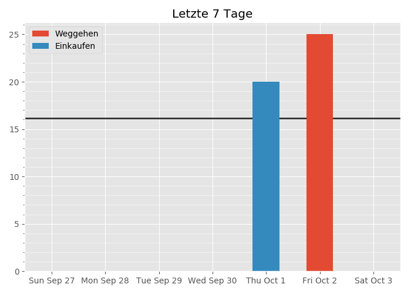

Welcome to GetOrganized, a simple dashboard and tracker for your expenses, diet, working hours and for managing your shoppinglist.

See here for build instructions: [building GetOrganized](build/README.md)

# Purpose

I built this tool for my personal use because similar apps do not do exactly what I want and I would need several apps for budgeting, calorie counting, etc. With GetOrganized, I have everything in one place. Additionally, I have direct access to my data and can analyze it e.g. in a Jupyter notebook or via SQL queries.

Moreover, I used this project to try out different technologies in web development without paying too much attention to the required effort. Because of this, everything is written with minimal use of frameworks.

It has also grown and changed considerably over time and has some typical edges and wrinkles of legacy software. However, this app has still stood the test of time and is used all the time in my daily workflow - a testament to the fact that good code is only loosely correlated with a good product ;) (Still, if I was to create a similar app from scratch, I would do it very differently nowadays.)

# What does it do?

GetOrganized allows you to enter and delete your expenses, consumed calories, etc. and visually represents them in bar charts with data for the last 7 days and last month, resp. One can set a monthly goal for the expenses or calories. The goal is represented in the bar charts, updated for each day. This provides an immediate visual feedback whether one is on track towards the monthly goal.
(The goal is currently set by editing a corresponding database entry.)

The generated charts look like this:

The black lines in the charts represent the goal for the current day, the red lines the goal for the week and month, resp. In the horizontal bar charts, the black line progresses every day until it meets the red line at the end of the week/month. (In the case of working hours, the black lines do not progress on Saturdays and Sundays.)

# Tech

I host GetOrganized on a Raspberry Pi running [NGINX](https://www.nginx.com/). The front end is written in the purely functional language [PureScript](https://www.purescript.org/), a non-lazy Haskell dialect which compiles directly to JavaScript. The front end communicates with the server via a REST API, written in PHP (a legacy left-over that can be replaced by something more robust). Upon entering or deleting an expense, calorie count, etc. the server starts a Python script which updates the charts. The Python script is based on [pandas](https://pandas.pydata.org/).

### Front End

The front end is built according to [The Elm Architecture](https://guide.elm-lang.org/architecture/), the architecture that later inspired Redux. Instead of Elm, however, I used [purescript-pux](https://github.com/alexmingoia/purescript-pux), as PureScript is far more flexible and powerful. Pux renders the web page using [Preact](https://preactjs.com/), a lightweight alternative to React.

In accordance to The Elm Architecture/Redux, the entire state of the web page is stored in a single object. How the page is rendered depends only on this global state object. Whenever an event, like a mouse click, is triggered, this event together with the current state is used to compute the new state of the app, or to trigger another event.

Side effects can only be executed via events. This makes this architecture robust and easy to maintain. Additionally, PureScript's excellent compiler and type system make it difficult to introduce bugs that result in runtime errors, and refactoring or introducing new components is a breeze.

### Design

The style sheets for GetOrganized were written entirely from scratch (except for the use of [Normalize.css](https://necolas.github.io/normalize.css/)) as an experiment. The design is responsive, i.e. works both on desktop and mobile, and does not utilize JavaScript to achieve this. The drop down menu in the mobile version is also written entirely in CSS by making use of (invisible) checkboxes.

### Back End

The REST API is written in plain PHP: as it only performs CRUD tasks, I went with something simple. POST and DELETE requests (e.g. when adding or deleting a calorie count) trigger a Python script that updates the corresponding charts with the help of pandas.

The Python scripts could be replaced by a proper (micro-) service (e.g. based on FastAPI), especially since they are quite slow. However, the speed of the chart generation was, so far, not very limiting since they are generated asynchronously in the background.
